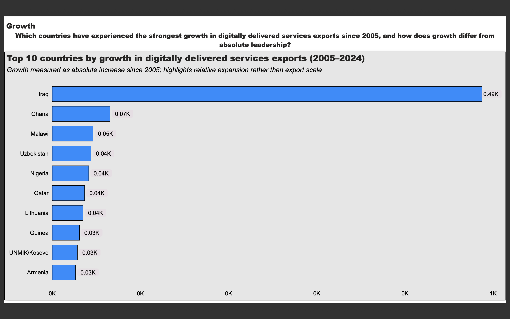
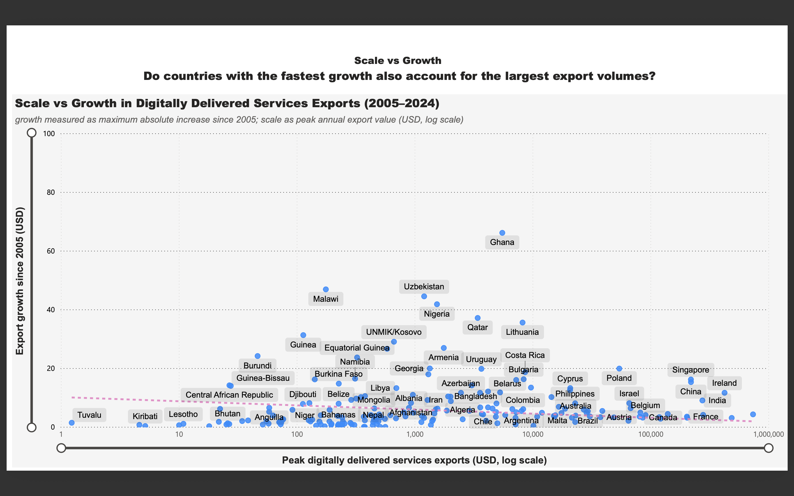

## Overview

This project builds a clean, analysis-ready dataset from WTO Digitally Delivered Services (DDS) exports data (2005–2024) and uses it to produce a Power BI dashboard analyzing global and country-level export dynamics.

The objective is to transform a raw, aggregate-heavy WTO dataset into BI-ready tables and a final dashboard that allows comparison across countries and over time, focusing on both export scale and growth performance.

Key questions addressed:
- how have global digitally delivered services exports evolved since 2005?
- which countries lead DDS exports in terms of scale?
- which countries have experienced the strongest export growth, and how does growth relate to scale?

---

## Power BI Dashboard

The final output of this project is a Power BI dashboard built on top of the unified BI-ready dataset.

### Dashboard preview

#### Scale — Global and country-level DDS exports


#### Growth — Countries with the strongest DDS export growth


#### Scale vs Growth — Export scale compared to growth performance


### Dashboard files
- Power BI file: `Dashboard/powerbi/dashboard.pbix`
- Static export (PDF): `Dashboard/exports/dashboard.pdf`

> Note: interactive sharing via Power BI Service may require a paid Power BI plan.

---

## Reproducibility (optional)

The data pipeline can be re-run locally to regenerate all intermediate tables and the final BI-ready dataset used by the dashboard.

## Outputs

This project produces multiple analysis-ready datasets derived from WTO DDS exports data (2005–2024).

### Core dataset
- `dds_exports_countries_only.csv`  
  Clean country-level DDS exports data (no aggregates).

### BI-ready tables
- `bi_country_year.csv`  
  Country-year DDS exports.
- `bi_country_growth.csv`  
  Growth rates and trends by country.
- `bi_global_year.csv`  
  Global DDS exports by year.

### Final unified dataset (recommended)
- `dds_bi_country_year_final.csv`  

This is the main output of the project.  
It combines:
- country-level DDS exports (USD)
- global DDS exports (USD, million)
- country growth indicators  

Designed for direct use in BI tools (Power BI Service, Tableau, Looker, etc.).

---

## How to run

```bash
# 1. Install dependencies
python3 -m pip install pandas

# 2. Generate BI base tables
python3 export_for_powerbi.py

# 3. Generate final unified dataset
python3 make_final_bi_dataset.py
